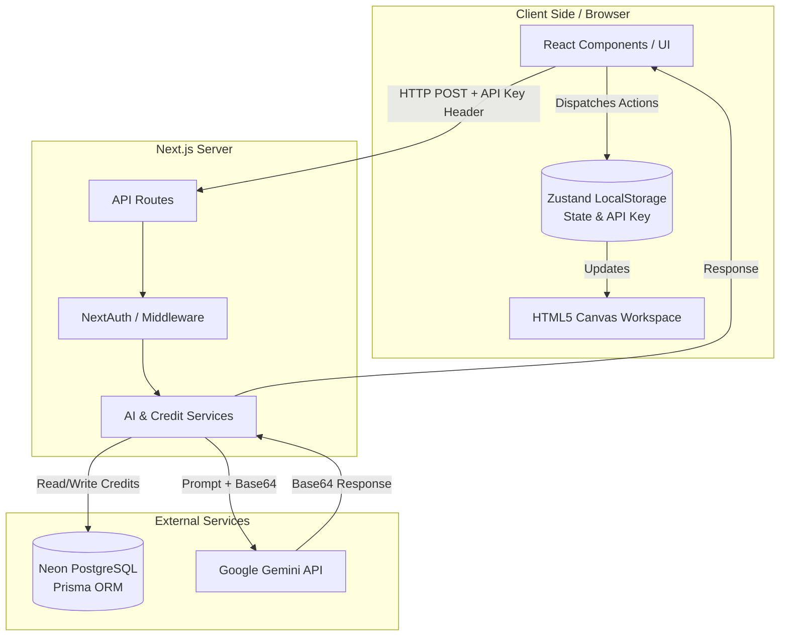
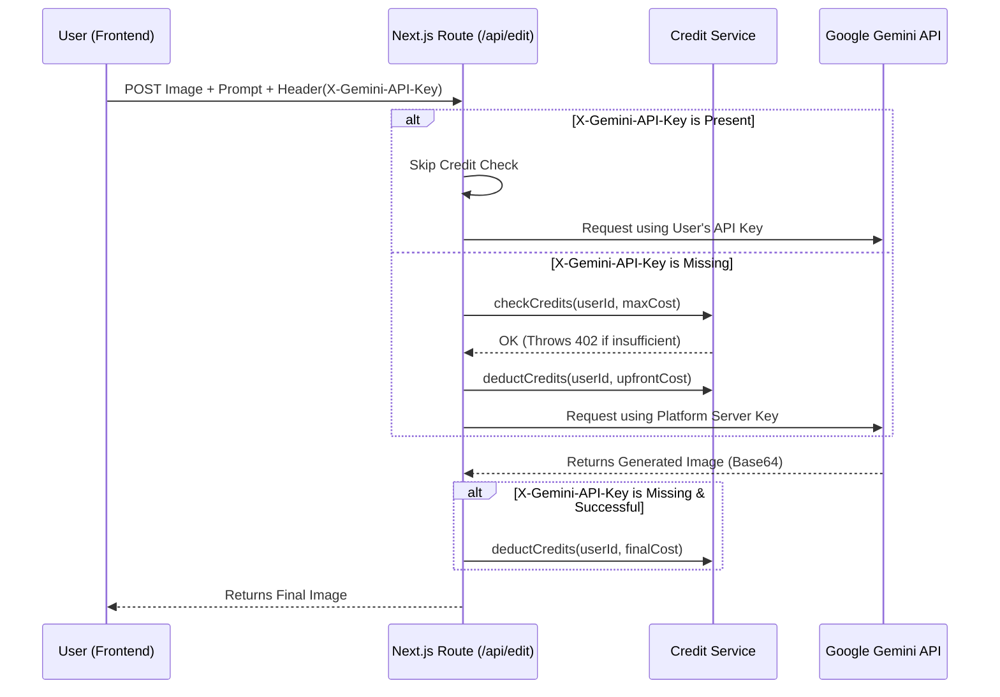
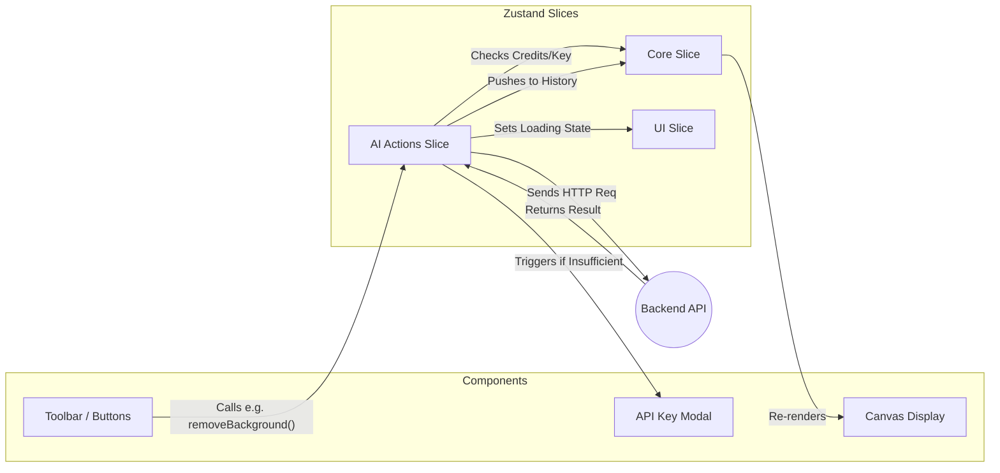

# 🎨 Img Studio - Advanced AI Image Editor

**Img Studio** is an enterprise-grade, full-stack AI Image Manipulation application built with Next.js, Prisma, PostgreSQL, and Google's Gemini Pro & Flash models. It provides a Photoshop-like web experience with advanced generative AI features.

---

## 🚀 Comprehensive Feature List

### 1. AI Generative Capabilities
- **Text-to-Image Generation:** Prompt-driven image generation using `gemini-2.5-flash-preview-05-20`. Supports multiple aspect ratios.
- **Smart Background Removal:** Uses generative segmentation to perfectly extract subjects from complex backgrounds.
- **Background Replacement:** Erases the background and generates a new contextual background based on a text prompt.
- **Semantic Recolor:** Users can paint a mask over a specific object and prompt the AI to recolor it (e.g., "Change the car to cherry red").
- **Facial Enhancement:** AI upscaling focused specifically on face restoration and lighting correction.
- **Canvas Expansion (Outpainting):** Expands the borders of an image intelligently, generating new content that matches the existing context.
- **Image Blending:** Seamlessly combines multiple user-uploaded images into a single cohesive output based on text instructions.

### 2. Credit Economy & "Bring Your Own Key" (BYOK)
- **Mathematical Costing:** Every action has a dynamic credit cost. Generating an image costs more than a simple background removal. Adding masks or multiple input files increases the cost dynamically.
- **Atomic Transactions:** Uses Prisma `$transaction` to ensure credits are deducted simultaneously with the creation of an audit log, preventing race conditions.
- **BYOK (Zero Liability):** Power users can provide their own Google AI Studio Key. This key is stored *only* in the browser's `localStorage` and sent via HTTP headers. The backend detects this header and completely bypasses the credit deduction system, ensuring the platform takes zero liability for storing sensitive user API keys.

### 3. Editor Workspace & State Persistence
- **Client-Side Canvas:** Real-time zooming, panning, and brush masking built with HTML5 Canvas.
- **Zustand State Engine:** Modular state management split into Slices (UI, Actions, Canvas, Core).
- **Undo/Redo Stack:** Every AI generation pushes the previous state to a history stack, allowing users to safely experiment.
- **Session Persistence:** Workspace state is actively saved to `localStorage`. Accidental page refreshes do not result in lost work.

---

## 🏗 System Architecture & Diagrams

### 1. High-Level System Architecture
This diagram outlines the physical separation of concerns across the stack.



### 2. "Bring Your Own Key" & Credit Flow (Sequence Diagram)
This sequence illustrates how the system intercepts requests to bypass billing if a user provides their own key.



### 3. Frontend State Management Flow (Zustand)
How the frontend React components interact with the AI without blocking the UI.



---

## 📂 Detailed Directory Structure

```text
├── prisma/
│   └── schema.prisma           # Relational schema (User, GeneratedImage, Transactions)
├── src/
│   ├── app/                    # Next.js 14 App Router
│   │   ├── (admin)/            # Protected admin panel for global management
│   │   ├── (auth)/             # NextAuth sign-in/up routes
│   │   ├── (protected)/        # Main app logic (Editor, Gallery, Profile)
│   │   └── api/                # Secure backend REST endpoints
│   ├── components/             
│   │   ├── editor/             # Complex editor modules (Canvas, Toolbars, Modals)
│   │   ├── ui/                 # Shadcn/Radix generic components
│   │   └── providers/          # Theme, Toast, and NextAuth Session providers
│   ├── config/                 # Static configuration (Zoom limits, Image sizes)
│   ├── lib/                    
│   │   ├── services/           # Backend Business Logic (AI, Auth, Credits, RateLimits)
│   │   └── utils/              # Client/Server agnostic helpers (Base64 compression)
│   ├── store/                  
│   │   ├── useEditorState.ts   # Root Zustand store composer
│   │   └── slices/             # Modular state logic
│   └── types/                  # Strict TypeScript interfaces
```

---

## 🧩 Deep Dive: Core Files & Functions

### Backend Services (`src/lib/services/`)

#### 1. `ai.service.ts`
- **Purpose:** The communication bridge to Google's Generative AI models.
- **Working Mechanism:** 
  - `createGoogleAI(userApiKey?)`: A factory function. If passed a string (the user's BYOK key), it initializes the standard `@google/generative-ai` SDK with that key. If undefined, it falls back to a Vertex AI integration or server-side standard key.
  - `buildImagePart()`: A utility that takes base64 strings and MIME types and formats them into the specific JSON schema required by Gemini's multimodal API.
  - `generateWithRetry()`: Wraps AI calls in an exponential backoff loop to automatically recover from HTTP `429 Too Many Requests` or `503 Service Unavailable` errors from Google's servers.

#### 2. `credits.service.ts`
- **Purpose:** The economic engine of the SaaS platform.
- **Working Mechanism:**
  - `checkCredits(userId, required)`: Queries the DB to ensure `user.credits >= required`. Throws a custom HTTP 402 exception if they fail, which the frontend catches to trigger the BYOK modal.
  - `deductCredits(userId, amount, reason)`: Uses `prisma.$transaction`. In a single atomic database operation, it decrements the user's `credits` integer and creates a row in `CreditTransaction` containing the `reason` (e.g., "Background Removal").

#### 3. `rate-limit.service.ts`
- **Purpose:** Abuse prevention.
- **Working Mechanism:** Uses either an Upstash Redis instance or an in-memory LRU cache. Every time an endpoint is hit, `checkRateLimit()` increments a counter tied to the user's ID and the current minute. If it exceeds the threshold defined in the DB's `SystemConfig`, it throws an HTTP 429.

### API Controllers (`src/app/api/`)

#### 1. `edit-image/route.ts` & `generate/route.ts`
- **Purpose:** Secure execution of AI tasks.
- **Working Mechanism:**
  1. **Authentication & Rate Limiting:** Verifies the JWT session and checks the rate limit bucket.
  2. **Header Interception:** Reads `request.headers.get('X-Gemini-API-Key')`.
  3. **Cost Prediction:** Calculates the maximum cost (e.g., Base Edit Cost + Mask Cost).
  4. **Billing:** If the user did not provide an API key header, it calls `checkCredits` and `deductCredits` for the upfront cost.
  5. **Execution:** Calls `ai.service.ts` passing the prompt, images, and the API key (if present).
  6. **Final Settlement:** If multiple candidates are returned, it deducts remaining credits based on the final output size.

### Frontend State (`src/store/`)

#### 1. `slices/ai-actions-slice.ts`
- **Purpose:** Maps UI button clicks to async AI workflows.
- **Working Mechanism:** 
  - Functions like `recolorArea(targetColor)` read the current `image` and `mask` from the store.
  - It calls a helper `checkSufficientCredits()`. If the user has neither credits nor an API key in local storage, it aborts the function and sets `showApiKeyModal: true`.
  - It triggers a loading spinner, calls the backend, receives the new Base64 image, and calls `pushToHistory()` to update the canvas while preserving the old state for undo.

#### 2. `useEditorState.ts`
- **Purpose:** Combines slices and handles persistence.
- **Working Mechanism:** Merges `core-slice`, `canvas-slice`, `ai-actions-slice`, and `ui-slice`. Uses Zustand's `persist` middleware with a custom `safeStorage` adapter. This adapter intercepts `localStorage` writes, explicitly checking if the Base64 image history is exceeding the browser's ~5MB quota, preventing silent crashes on large workspaces.

### Key Components (`src/components/editor/`)

#### 1. `canvas/image-editor.tsx`
- **Purpose:** The interactive workspace.
- **Working Mechanism:** A complex React component managing an HTML5 `<canvas>`. It tracks mouse events (`onMouseDown`, `onMouseMove`, `onMouseUp`) to draw paths. When in "Mask" mode, it draws with a specific composite operation (`destination-out`) to create transparency masks, which are then exported as Base64 PNGs and attached to AI requests (e.g., for Semantic Recolor).

#### 2. `modals/api-key-modal.tsx`
- **Purpose:** The BYOK collection interface.
- **Working Mechanism:** When rendered, it presents an input field. On save, it calls `useEditorStore.getState().setApiKey(key)`. This string is immediately persisted to `localStorage` via Zustand. From that moment on, all frontend HTTP requests automatically inject this key into their headers, bypassing the billing system.
